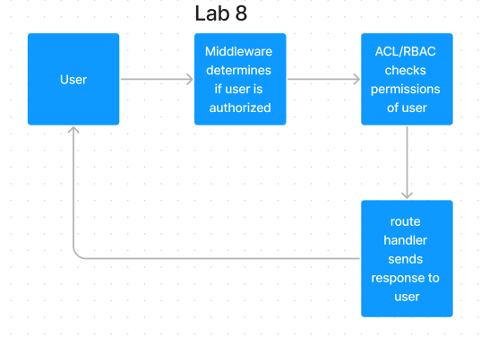

# Lab 8 401

## Auth API

API Server with SQL and Postgres

### Author: Mike Pace

### Links and Resources

-[Repo](https://github.com/catdude2000/auth-api)  
-[Render Deploy](https://mikes-auth-api.onrender.com/)  

### Collaborators  

### Setup

#### .env requirements (where applicable)

port variable exists within the env sample  
PORT - 3000

#### Running the app

clone repo  
`npm i`  
`npm start`  

Endpoint: `/`  
Returns Object

```
```

#### Tests

Unit Tests: npm run test
Lint Tests: npm run lint

#### UML

(Created with Figma)


